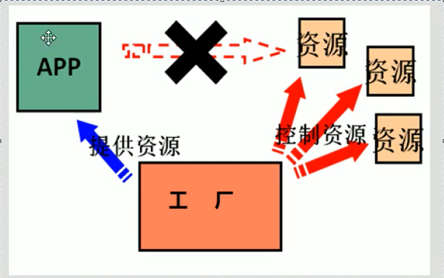
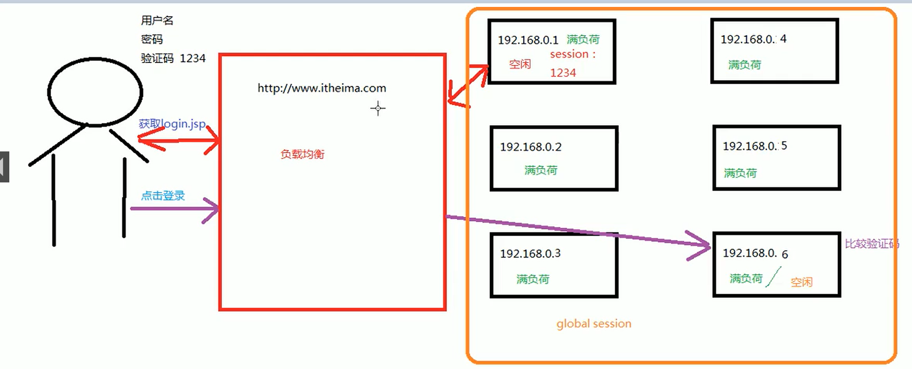
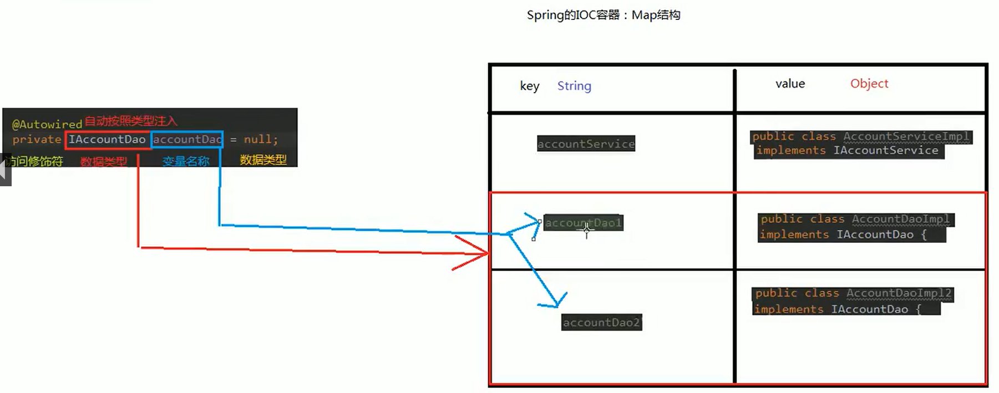

# SpringLearning
学习Spring

**********************

### 一些基本概念

* 耦合 ： 程序间的依赖关系，包括类耦合，方法耦合

* 结构 ： 解除程序间的依赖关系

* 目的 ： 编译时不依赖，运行时依赖

* 解决思路 
  * 通过反射来创建对象，避免使用new关键字
  * 通过读取配置文件来获取要创建对象的全限定类名
  
* BeanFactory实现单例模式
  * 首相给静态工厂类添加一个**Map<String, Object>**属性
  * 在静态代码块中初始化时就创建所有的Bean对象，存放在HashMap中
  * 此时这个Map就是**Spring容器**
  
* IOC概念和作用

  * 工厂模式与new模式的区别

     
  
  *  IOC概念 ： 把创建对象的控制权交给框架。 通俗解释： 放弃对象创建的权利，把权利交给工厂，让工厂来创建对象

*****************************

### Spring入门案例

* 创建maven工程并导入依赖

  * ```xml
    <dependency>
        <groupId>org.springframework</groupId>
        <artifactId>spring-context</artifactId>
        <version>5.0.2.RELEASE</version>
    </dependency>
    ```
  
* 创建bean.xml配置，导入xml依赖并配置自己的bean对象

  * xml依赖在 https://docs.spring.io/spring/docs/5.1.14.RELEASE/spring-framework-reference/core.html#spring-core 可以找到

    ```xml
    <?xml version="1.0" encoding="UTF-8"?>
    <beans xmlns="http://www.springframework.org/schema/beans"
        xmlns:xsi="http://www.w3.org/2001/XMLSchema-instance"
        xsi:schemaLocation="http://www.springframework.org/schema/beans
            https://www.springframework.org/schema/beans/spring-beans.xsd">
        <!--自己添加的bean配置-->
        <bean id="UserService" class="zy.service.UserService" />
    </beans>
    ```
  
* 在需要的地方使用

  * 读取配置文件创建容器对象 `ApplicationContext ac=new ClassPathXmlApplicationContext("bean.xml");`
  * 根据容器对象获取想创建的对象 
    * `UserService userService= (UserService) ac.getBean("UserService");`
    * `UserService userService=ac.getBean("UserService",UserService.class)` 传入字节码不用强转类型
* 总结：通过读取配置文件反射创建对象，实现IOC控制反转。

***********************

### 容器的一些知识
* ApplicationContext的三个实现类
  * ClassPathXmlApplicationContext("bean.xml") : 只能加载类路径下的配置文件 (比较常用)
  
  * FileSystemXmlApplicationContext(C:\\\user\\izumisaki\\desktop\\bean.xml)： 可以加载磁盘路径下任意有访问权限的配置文件
  
  * AnnotationConfigApplicationContext ： 用于读取注解创建容器
* BeanFactory和ApplicationContext的区别
  * BeanFactory是Spring容器的顶层接口，ApplicationContext是BeanFactory的子接口
  * ApplicationContext在构建容器时，采用**立即加载**的方式，只要一创建就马上往Map中创建存入Bean对象
    * 适用于单例模式
  * BeanFactory在构建容器时，采用**延迟加载**方式，使用时才创建对象
    * 适用于多例模式
  * BeanFactory的实现对象已经过时，不建议使用。

******************

### Spring中Bean的一些细节

* 创建Bean对象的三种方式

  * 第一种：使用默认构造函数创建，如果没有默认构造函数会报错。只有id和class标签

    ```xml
    <bean id="ServiceImpl" class="zy.service.ServiceImpl" />
    ```
    
  * 第二种 ：使用某个类的方法创建对象，并存入Spring容器。即类方法的返回值为对象
  
    ```xml
    <bean id="instanceFactory" class="zy.factory.InstanceFactory" />
    <bean id="serviceImpl" factory-bean="instanceFactory" factory-method="getServiceImpl" />
    ```
    * 使用**factory-bean和factory-method**属性
    
  * 第三种：使用某个类的静态方法创建对象，并存入Spring容器。即类静态方法返回值为对象，如工厂类
  
    ```xml
    <bean id="serviceImpl" class="zy.factory.StaticFactory" factory-method="getServiceImpl" />
    ```
    * 一定要是静态方法才行
  
* Bean的作用范围
  
  * <bean>标签的scope属性取值
    * singleton : 单例的，且为默认取值
    * prototype ： 多例的
    * request ： web请求域
    * session ： web会话域     * glable-session ： 全局会话范围  （5.0）把这个移除了
      
    * 全局session与负载均衡
    
      
      
      * glable-session存验证码，所有服务器都能使用
    
  * bean的生命周期
    
    * 单例对象 ：生命周期和**容器**一模一样
    
    * init和destroy方法 ： `<bean id="serviceImpl" class="zy.factory.StaticFactory" factory-method="getServiceImpl" scope="singleton" init-method="init" destroy-method="destroy" />`
    
    * 多例对象 ：使用时创建；长时间不用且没有对象引用时由java垃圾回收销毁
    
*********************

### Spring的依赖注入

* 依赖注入概念 ： 依赖关系的维护

* 能注入的数据类型
  * 基本类型和String
  * 其他已经配置的Bean类型
  * 复杂类型/集合类型
  
* 注入的方式

  * 使用构造函数提供

    * ```xml
      <bean id="serviceImpl" scope="singleton" class="zy.service.ServiceImpl">
          <constructor-arg name="name" value="IzumiSkai" />  <!--基本类型-->
          <constructor-arg name="age" value="40" />  <!--Integer类型-->
          <constructor-arg name="birthday" ref="now" /> <!--其他类型  使用ref属性注入-->
      </bean>
      <bean id="now" class="java.util.Date" />
      ```

    * <bean>标签下嵌套<constructor-arg>标签

      * <constructor>属性    type，index，name都是在找给谁注入，其中name最常用
      * <constructor>属性    value为依赖注入的值
      * <constructor>属性    ref用Spring核心容器中出现过的对象类注入值
    
    * 优点 ：创建时注入是必须操作
  
    * 缺点 ：要是一开始想先不注入而不能实现
  
  * 使用set方法提供
  
    * ```xml
      <bean id="setMethodInjection" scope="singleton" class="zy.service.SetMethodInjection">
          <property name="name" value="IzumiSakai" />
          <property name="age" value="40" />
          <property name="birthday" ref="now" />
      </bean>
      <bean id="now" class="java.util.Date" />
      ```
    * 使用<bean>标签嵌套<property>标签，<property>的属性和<constructor-arg>类似
    
  * 使用注解提供
  
  * 使用set为容器集合注入
  
    ```xml
    <!--为容器注入-->
    <bean id="collectionInjection" class="zy.service.CollectionInjection" scope="singleton">
        <!--String[]注入-->
        <property name="stringArray">
            <array>
                <value>first</value>
                <value>second</value>
                <value>third</value>
            </array>
        </property>
        <!--List<String>注入-->
        <property name="list">
            <list>
                <value>first</value>
                <value>second</value>
                <value>third</value>
            </list>
        </property>
        <!--map注入-->
        <property name="map">
            <map>
                <entry key="1" value="first" />
                <entry key="2" value="second" />
                <entry key="3" value="third" />
            </map>
        </property>
        <!--properties注入-->
        <property name="properties">
            <props>
                <prop key="1">first</prop>
                <prop key="2">second</prop>
                <prop key="3">third</prop>
            </props>
        </property>
    </bean>
    ```
*****************
### 基于注解的IOC

* 首先创建bean.xml，依赖为带有xmlns:context的依赖，并配置要扫描的包

  ```xml
  <?xml version="1.0" encoding="UTF-8"?>
  <beans xmlns="http://www.springframework.org/schema/beans"
         xmlns:xsi="http://www.w3.org/2001/XMLSchema-instance"
         xmlns:context="http://www.springframework.org/schema/context"
         xsi:schemaLocation="http://www.springframework.org/schema/beans
          https://www.springframework.org/schema/beans/spring-beans.xsd
          http://www.springframework.org/schema/context
          https://www.springframework.org/schema/context/spring-context.xsd">
      <context:component-scan base-package="zy" />
  </beans>
  ```
  
* 用于创建对象的

  * `@Component` : 属性值为value，默认为类名且首字母小写
  * `@Controler` : 用于表现层
  * `@Service` : 用于业务层
  * `@Repository` : 用于持久层
  
* 用于注入数据的

  * `@Autowired` : 自动按照类型注入，只要spring容器中有唯一一个与之类型匹配的就可以注入成功
    * 出现位置 ：方法或变量
    * 细节 ： 使用注解注入，set方法就不是必须的了
    * 为接口注入，实现类的bean居然也可以。但有两个实现类就有可能会报错
    * 当遇到多个bean匹配时。首先根据数据类型匹配容器map的value，在根据变量名称匹配容器map的key
    * 
  * `@Resource(name='accountDao')` : 按照指定bean的id注入
    *  name属性 ：指定注入bean的id
  * `@Value` : 用于注入基本类型和String类型
* 用于改变作用范围

  * `@Scope` : value属性值为singleton或者prototype
******************
### spring注解实例

* 案例整合mybatis和spring，能实现CRUD
* 测试过程中`SqlSessionFactoryBuilder`对象无法通过spring反射创建，可能还需要另外配置
* spring注解的地方
  * `@Repository("userMapper")` 类UserMapperImpl
  * `@Service("userService")` 类UserService `@Resource(name="userMapper")` 类UserService的属性成员IUserMapper
********************

### spring完全不用xml的注解实例

* 案例整合mybatis和spring，能实现CRUD

* 测试过程中`SqlSessionFactoryBuilder`对象无法通过spring反射创建，可能还需要另外配置

* spring注解的地方

  * `@Repository("userMapper")`  类UserMapperImpl

  * `@Service("userService")` 类UserService ——`@Resource(name="userMapper")` 类UserService的属性成员IUserMapper
  
* 如何完全实现注解不用bean.xml

  ```java
  @Configuration
  @ComponentScan({"zy"})
  @Import(JdbcConfig.class)
  @PropertySource("jdbcConnection.properties")
  public class SpringConfiguration {
      @Bean(name = "builder")
      @Scope("prototype")
      public SqlSessionFactoryBuilder createSqlSessionFactoryBuilder(){
          return new SqlSessionFactoryBuilder();
      }
  }
  ```
* `@Configuration` : 表明这是配置类
* `@ComponentScan({"zy"})` : 表明要扫描的包。value属性是一个数组
* `@Bean(name = "builder")` : 创建对象并存入spring容器中
  
  * 如果需要注入配置就直接在类体内用构造方法或者使用set来注入
* `@Import(JdbcConfig.class)` : 导入其他的配置类，这样在AnnotationConfigApplicationContext传参就只用传一个class字节码。有@Import的是主配置类，里面**value数组**的类是子配置类
* `@PropertySource("classpath:jdbcConnection.properties")` :导入property配置文件。可以直接用${jdbc.url}获取里面的值。classpath关键字表示类路径
* 使用`AnnotationConfigApplicationContext` 并传入配置类的字节码来生成容器。`ApplicationContext ac=new AnnotationConfigApplicationContext(SpringConfiguration.class);`

*************************

### 事务控制基础

* 执行转账操作的时候会和数据库打交道4次，每次获取的都是不同的connection对象。比如查询转账者，被转账者，这涉及两个connection对象。则整个操作无法被视作一次事务，出现错误也无法回滚。
* 基于上述情况，用**ThreadLocal**为每一个线程绑定单独的connection，用手动try和catch方式手动提交回滚事务

****************

### AOP基本概念

* 代理举例：现在买电脑修电脑不能直接取找厂家，没有这条路径了。现在都是去找代理商，代理商在和厂家产生联系
* AOP作用 ：在程序运行期间，不修改源码的基础上对已有方进行i增强
* AOP优势 ： 减少重发代码，提高开发效率，维护方便
* AOP一些术语
  * 连接点 ： 业务层接口中所有的方法
  * 切入点 ： 业务层中被动态代理增强了的方法
  * 切入点一定是连接点，连接点不一定是切入点
* AOP的前置，后置，异常，最终，环绕通知
  * 前置 ：method.invoke()之前——相当于开启手动提交事务
  * 后置 ：method.invoke()之后——相当于提交事务
  * 异常 ： catch里面——相当于事务回滚
  * 最终 ： finally里面——相当于释放与事务有关的资源
  * 环绕 ： 在调用invoke方法时，有明确的切入点方法调用

****************

### AOP入门案例

* 与AOP相关的都要导org.aspectj包

* 首先导入含有**xmlns:aop**的xml依赖

* 在导入aspectj,用于解析\*简写的解析

  * ```xml
    <dependency>
        <groupId>org.aspectj</groupId>
        <artifactId>aspectjweaver</artifactId>
        <version>1.8.7</version>
    </dependency>
    ```

* spring中基于XML的AOP配置步骤

  * 1、把通知Bean也交给spring来管理
  * 2、使用aop:config标签表明开始AOP的配置
  * 3、使用aop:aspect标签表明配置切面
     * id属性：是给切面提供一个唯一标识
     * ref属性：是指定通知类bean的Id。
  * 4、在aop:aspect标签的内部使用对应标签来配置通知的类型
     * 我们现在示例是让printLog方法在切入点方法执行之前之前：所以是前置通知
         * op:before：表示配置前置通知
         * method属性：用于指定Logger类中哪个方法是前置通知
         * pointcut属性：用于指定切入点表达式，该表达式的含义指的是对业务层中哪些方法增强

* 切入点表达式的写法：
  * 关键字：execution(表达式)
  * 表达式：访问修饰符  返回值  包名.包名.包名...类名.方法名(参数列表)
      * 标准的表达式写法：public void com.itheima.service.impl.AccountServiceImpl.saveAccount()
      * 访问修饰符可以省略：void com.itheima.service.impl.AccountServiceImpl.saveAccount()
      * 返回值可以使用通配符，表示任意返回值： * com.itheima.service.impl.AccountServiceImpl.saveAccount()
      * 包名可以使用通配符，表示任意包。但是有几级包，就需要写几个* ：.\* \*.\*.\*.\*.AccountServiceImpl.saveAccount())
      * 包名可以使用..表示当前包及其子包： \* \*..AccountServiceImpl.saveAccount()
      * 类名和方法名都可以使用*来实现通配： \* \*..\*.\*()
  
* 参数列表：
  * 可以直接写数据类型：
      * 基本类型直接写名称：int
      * 引用类型写包名.类名的方式：java.lang.String
  * 可以使用通配符表示任意类型，但是必须有参数
  * 可以使用..表示有无参数均可，有参数可以是任意类型
  * 全通配写法：\* \*..\*.\*(..)
  * 实际开发中切入点表达式的通常写法为切到业务层实现类下的所有方法：\* zy.service.AccountService\*.\*(..)
  
* 入门代码

  ```xml
  <!--配置AccountService类-->
  <bean id="accountService" class="zy.service.AccountService" />
  
  <!--配置Logger类-->
  <bean id="logger" class="zy.utils.Logger">
      <property name="date" ref="date"></property>
  </bean>
  <bean id="date" class="java.util.Date" />
  
  <!--配置AOP-->
  <aop:config>
      <!--配置切面，表示要用来增强的类-->
      <aop:aspect id="loggerAdvice" ref="logger" >
          <!--表示是前置通知-->
          <aop:before method="log" pointcut=
                  "execution(public void zy.service.AccountService.saveAccount())" />
      </aop:aspect>
  </aop:config>
  ```

  * 注 ：实现的时候必须数据类型和对象类型都是接口才行，不然报错。使用代理后获取的对象已经不是说接口了，而是代理对象。和mybatis的getMapper很像

    * ```java
      private IAccountService accountService=ac.getBean("accountService",IAccountService.class);
      ```
      
****************

### AOP中的五种通知类型

* 前置通知、后置通知、异常通知、最终通知。其中后置通知和异常通知永远只能执行一个

* < aop:before >,< aop:after-returning > ,< aop:after-throwing ,,< aop:after >。注意后置和最后的名字区别
  
  * ```xml
    <aop:config
            <aop:aspect id="loggerAdvice" ref="logger" >
                <!--前置通知-->
                <aop:before method="beforeLog" pointcut="execution(* zy.service.AccountService.*(..))" />
                <!--后置通知-->
                <aop:after method="afterLog" pointcut="execution(* zy.service.AccountService.*(..))" />
                <!--异常通知-->
                <aop:after-throwing method="afterThrowingLog" pointcut="execution(* zy.service.AccountService.*(..))" />
                <!--最终通知-->
                <aop:after-returning method="afterReturningLog" pointcut="execution(* zy.service.AccountService.*(..))" />
            </aop:aspect>
        </aop:config>
    ```
  
* < aop:pointcut >的使用

  * 此标签根据xml的约束必须放在< aop:aspect >标签里面或外面的前面

  * ```xml
    <aop:pointcut id="pointcut1" expression="execution(* zy.service.AccountService.*(..))"/>
    <aop:after method="afterLog" pointcut-ref="pointcut1" />
    ```
  
* 环绕通知的使用

  * ```java 
    public Object aroundLog(ProceedingJoinPoint pjp){
        Object rtValue = null;
        try{
            Object[] args = pjp.getArgs();//得到方法执行所需的参数
            System.out.println("Logger类中的aroundPringLog方法开始记录日志了。。。前置");
            rtValue = pjp.proceed(args);//明确调用业务层方法（切入点方法）
            System.out.println("Logger类中的aroundPringLog方法开始记录日志了。。。后置");
            return rtValue;
        }catch (Throwable t){
            System.out.println("Logger类中的aroundPringLog方法开始记录日志了。。。异常");
            throw new RuntimeException(t);
        }finally {
            System.out.println("Logger类中的aroundPringLog方法开始记录日志了。。。最终");
        }
    }
    ```
    
  * 问题：当我们配置了环绕通知之后，切入点方法没有执行，而通知方法执行了。
  
  * 分析：通过对比动态代理中的环绕通知代码，发现动态代理的环绕通知有明确的切入点方法调用，而我们的代码中没有。
  
  * 解决：Spring框架为我们提供了一个接口：ProceedingJoinPoint。该接口有一个方法proceed()，此方法就相当于明确调用切入点方法。该接口可以作为环绕通知的方法参数，在程序执行时，spring框架会为我们提供该接口的实现类供我们使用。
  
  * spring中的环绕通知另外一种理解：它是spring框架为我们提供的一种可以在代码中手动控制增强方法何时执行的方式。 

***************************

### 基于注解的AOP配置

* 与AOP相关的都要导org.aspectj包

* 引入context依赖并配置扫描包的范围

* bean.xml中加上一句这个`<aop:aspectj-autoproxy />`。不加不能运行、

* 注解配置的切面类Logger如下

  * ```java
    @Component("logger")
    @Aspect//表示当前类是一个切面类
    public class Logger {
        @Resource(name = "date")
        private Date date;
    
        @Pointcut("execution(* zy.service.AccountService.*(..))")
        public void pointCut(){}
    
        @Before("execution(* zy.service.AccountService.*(..))")
        public void beforeLog(){
            System.out.println("前置日志："+date.toString());
        }
        @AfterReturning("pointCut()")
        public void afterReturningLog(){
            System.out.println("后置日志："+date.toString());
        }
        @AfterThrowing("execution(* zy.service.AccountService.*(..))")
        public void afterThrowingLog(){
            System.out.println("异常日志："+date.toString());
        }
        @After("execution(* zy.service.AccountService.*(..))")
        public void afterLog(){
            System.out.println("最终日志："+date.toString());
        }
    
        public void setDate(Date date) { this.date = date;}
    }
    ```
  
* `@Component("logger")`是用注解配置IOC
  
  * `@Aspect` 是表明这是一个切面类
  
  * `@Resource(name = "date")`是IOC依赖注入
  
  * `@Pointcut("execution(* zy.service.AccountService.*(..))")`是在定义切入点，注解下面的空方法名字就是这个定义的id
  
  * `@Before("execution(* zy.service.AccountService.*(..))")`前置方法定义，其中的value值填入的是切入点
  
  * `@AfterReturning("pointCut()")`后置方法定义，其中value值填入的是已经定义好的切入点id。**一定注意要加上括号**
* 但spring注解AOP的几个通知调用次序有bug且最新版还未解决，注解配置AOP慎用。但是可以用注解配置环绕通知
